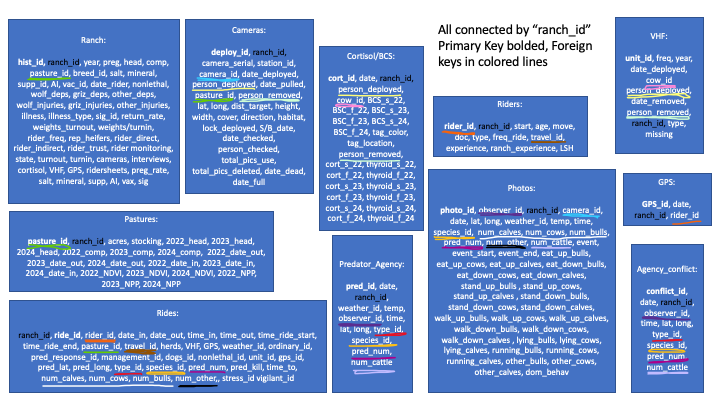

--- 
title: "My semester project website"
author: "Rae Nickerson"
date: "`r Sys.Date()`"
site: bookdown::bookdown_site
documentclass: book
bibliography: [book.bib, packages.bib]
# url: your book url like https://bookdown.org/yihui/bookdown
# cover-image: path to the social sharing image like images/cover.jpg
description: |
  This will be my end of semester project webpage showing the progress on my
  organizing of my data for the CoW-CIG. 
link-citations: yes
github-repo: rstudio/bookdown-demo
output: 
  html_document:
    toc: true
    toc_depth: 4
    toc-title: "Table of Contents"
# For some reason this code to make a table of contents is not working
---

# About

The CoW-CIG (Conservation on Workinglands Conservation Innovation Grant Team) is 
a group of livestock producers, researchers, graduate students, and NGO partners
working together to evaluate the effectiveness of nonlethal tools at reducing 
conflicts between livestock, wolves, and grizzly bears. My work focuses on range 
riding - a tool where riders provide human presence among a livestock herd while
monitoring and managing the activity of livestock and predators. 

This semester project will focus on organizing my database, and visualizing predator presence across camera site locations from our pilot in eastern Washington. 

<!--chapter:end:index.Rmd-->

# Creating My Database

This chapter will focus on creating the database for my predator data. Sources of
predator data include 1. my game cameras, 2. data from range rider data sheets, 
3. data from range rider/ranch game cameras, and 4. data from wildlife agencies 
(sightings, collar data, and conflict data).

  
```{r diagram, eval=TRUE, echo=FALSE, out.width='100%', fig.align='center', fig.cap="Diagram Illustrating the Structure of the Database"}

```
  
Unfortunately, I will only have camera data from our pilot to analyze at this time, so I will
be focusing on a new table I created just for this task (not listed here in this database). However, when analyzing our actual data, I will be using the tables Cameras, Photos, Rides, and Predator_Agency to consolidate all predator data for a single season, by location. Colored lines represent variables shared
across tables.

## Starting the Databse {-}

I'll start by loading the `DBI` and `RSQLite` packages:
```{r pkg, eval = FALSE, echo = FALSE, warning = FALSE, message = FALSE, error = FALSE}
library(RSQLite)
library(ggplot2)
library(tidyverse)
library(dplyr)
library(lubridate)
library(RMySQL)
library(DBI)
```

## Creating the database connection to my SQLite database {-}

```{r connection, eval = FALSE, echo = TRUE}
cow_cig_db <- dbConnect(RSQLite::SQLite(), 
                    "CoW_CIG.db")
```

## Creating the cameras table

This table includes all information about deployed cameras at each field site, including camera serial numbers, personnel deployed, total pictures, height, percent cover at location, and more. The `deploy_id` column contains a unique identifier, and as such, is the primary key of the table. All tables in this study are connected by the `ranch_id` variable.

```{r cameras-table, eval = FALSE, echo = FALSE}
dbExecute(cow_cig_db, "CREATE TABLE cameras (
                          deploy_id integer PRIMARY KEY AUTOINCREMENT,
                          camera_id varchar(10),
                          ranch_id varchar(10),
                          station_id varchar(5),
                          date_deploy text, 
                          person_deploy varchar(10) CHECK (person_deploy IN ('Rae', 'tech1', 'tech2')),
                          date_pull text,
                          person_remove varchar(10) CHECK (person_remove IN ('Rae', 'tech1', 'tech2')),
                          lat double,
                          long double,
                          pasture_id varchar(10),
                          dist_target_m char(3),
                          height_f char(3),
                          width char(3),
                          cover_percent char(20),
                          direction varchar(20) CHECK (direction IN ('N', 'S', 'E', 'W', 'NW', 
                          'NE', 'SW', 'SE')),
                          habitat varchar(20),
                          lock char(1),
                          S_B_date text,
                          date_check text,
                          person_check text CHECK (person_check IN ('Rae', 'tech1', 'tech2')), 
                          total_pics char(20),
                          pics_delete char(20),
                          date_dead text,
                          date_full text,
                          FOREIGN KEY (ranch_id) REFERENCES ranches(ranch_id),
                          FOREIGN KEY (camera_id) REFERENCES cameras(camera_id),
                          FOREIGN KEY (person_deploy) REFERENCES cameras(person_deployed),
                          FOREIGN KEY (pasture_id) REFERENCES pastures(pasture_id),
                          FOREIGN KEY (person_remove) REFERENCES cameras(person_removed)
                          );")
```

Preview of the cameras table:

```{r show-cameras, eval = FALSE, echo = FALSE}
dbGetQuery(cow_cig_db, "SELECT * FROM cameras LIMIT 20;")
```

## Creating the photos table

This table includes all information related to each individual photo from all game cameras across sites, including observer name, behavior of the cattle in each photo, species, number of individuals, and more. The `photo_id` column contains a unique identifier, and as such, is the primary key of the table.

```{r photos-table, eval = FALSE, echo = FALSE}
dbExecute(cow_cig_db, "CREATE TABLE photos (
                          photo_id integer PRIMARY KEY AUTOINCREMENT,
                          ranch_id varchar(20),
                          camera_id varchar(10),
                          date text,
                          observer_id varchar(10) CHECK (observer_id IN ('Rae', 'tech1', 'tech2')),
                          weather_id varchar(10),
                          temp char(3),
                          time char(4),
                          lat double,
                          long double,
                          species_id varchar(10),
                          pred_num char(3),
                          num_other char(3),
                          num_calves char(3),
                          num_bulls char(3),
                          num_cows char(3),
                          num_cattle char(3),
                          event char(5),
                          event_start char(4),
                          event_end char(4),
                          eat_up_bulls char(3), 
                          eat_up_cows char(3),
                          eat_up_calves char(3),
                          eat_down_bulls char(3), 
                          eat_down_cows char(3),
                          eat_down_calves char(3),
                          stand_up_bulls char(3), 
                          stand_up_cows char(3),
                          stand_up_calves char(3),
                          stand_down_bulls char(3), 
                          stand_down_cows char(3),
                          stand_down_calves char(3),
                          walk_up_bulls char(3), 
                          walk_up_cows char(3),
                          walk_up_calves char(3),
                          walk_down_bulls char(3), 
                          walk_down_cows char(3),
                          walk_down_calves char(3),
                          lying_bulls char(3), 
                          lying_cows char(3),
                          lying_calves char(3),
                          running_bulls char(3), 
                          running_cows char(3),
                          running_calves char(3),
                          other_bulls char(3), 
                          other_cows char(3),
                          other_calves char(3),
                          dom_behav varchar(10),
                          FOREIGN KEY (ranch_id) REFERENCES ranches(ranch_id),
                          FOREIGN KEY (camera_id) REFERENCES cameras(camera_id),
                          FOREIGN KEY (observer_id) REFERENCES cameras(observer_id),
                          FOREIGN KEY (species_id) REFERENCES photos(species_id),
                          FOREIGN KEY (num_calves) REFERENCES photos(num_calves),
                          FOREIGN KEY (num_cows) REFERENCES photos(num_cows),
                          FOREIGN KEY (num_bulls) REFERENCES photos(num_bulls),
                          FOREIGN KEY (num_other) REFERENCES photos(num_other),
                          FOREIGN KEY (num_cattle) REFERENCES photos(num_cattle),
                          FOREIGN KEY (pred_num) REFERENCES photos(pred_num)
                          );")
```

Preview of the photos table:
```{r show-photos, eval = FALSE, echo = FALSE}
dbGetQuery(cow_cig_db, "SELECT * FROM photos LIMIT 20;")
```

## Creating the WA_DM table (pilot data)

This table includes all information about deployed cameras at our pilot field site in Washington from the summer of 2021, including photo id, date, camera model, camera id, station id, species, number of individuals, and number of individuals per photo event. The `photo_id` column contains a unique identifier, and as such, is the primary key of the table.

```{r pilot-table, eval = TRUE, echo = TRUE}
dbExecute(cow_cig_db, "CREATE TABLE WA_DM_F (
                          photo_id integer PRIMARY KEY AUTOINCREMENT,
                          date_pic text,
                          cam_model varchar(10), 
                          cam_id varchar(10),
                          station_id varchar(10),
                          species_id varchar(20),
                          num char(20),
                          num_individ_pics char(20)
                          );")
```

Preview of the pilot table:
```{r show-pilot, eval = TRUE, echo = TRUE}
dbGetQuery(cow_cig_db, "SELECT * FROM WA_DM_F LIMIT 20;")
```

<!--chapter:end:01-database.Rmd-->

# Brining in, and cleaning my data

Since my pilot data did not focus on cattle behavioral analysis, there will be little to no data on cows. Instead, I will focus on cleaning my data for visualizing wild species presence across camera sites. 

This pilot was in eastern Washington (just outside Colville) and focused on comparing cameras placed at the center of each camera grid cell to those placed on roads, trails, or other sites where we would expect to see more wildlife use - with a focus on capturing wolf presence.

## Brining in the pilot data

```{r data drop, eval = TRUE, echo = TRUE}
WAP <- dbGetQuery(cow_cig_db, "SELECT * FROM WA_DM_F;")
```

Alternative way to bring in the data: 

```{r csv_connection, eval = TRUE, echo = TRUE}
WAP <- read.csv("WA_DM_Final.csv", na = "NA")
```

## Cleaning the data

For some reason, R is reading in my csv file to have 99+ variables. So first I will remove all unneeded columns to just have the data collected, focusing on what might be useful later for data visulization.

```{r data, eval = TRUE, echo = TRUE}
# species occurrence table

S_O <- WAP %>% 
  select(date_pic, cam_id, station_id, species_id, num_individ_pics)
```

Notice that I selected the "num_individ_pics" column over the "num" column. This is because the "num_individ_pics" column show the number of individuals of a certain species per photo. For ranchers worried about predator pesence, knowing how many animals are around is important. 

Now let's make sure our date column is being read correctly by R using Lubridate

```{r date, eval = TRUE, echo = TRUE}
S_O <- S_O %>% 
  mutate(date_pic = ymd(date_pic))
class(S_O$date_pic)
```

Next, let's make sure all NA's, UNKNONWS, and ?s are set to NA, and make sure our columns are the correct data class

First, let's check the class for each column (except date_pic which we've already dealt with)

```{r class, eval = TRUE, echo = TRUE}
class(S_O$cam_id)
class(S_O$station_id)
class(S_O$species_id)
class(S_O$num_individ_pics)
```

Our num_individ_pics is the integar class, which is good, but our other variables need to be switched to as.factor so that we can categorize by cam_id, station_id, and species_id. 

```{r slice, eval = TRUE, echo = TRUE}
S_O$station_id <- as.factor(S_O$station_id)
S_O$cam_id <- as.factor(S_O$cam_id)
S_O$species_id <- as.factor(S_O$species_id)
```

Now, let's check that it worked

```{r check, eval = TRUE, echo = TRUE}
class(S_O$station_id)
class(S_O$species_id)
class(S_O$cam_id)
```

Next, let's standardize all the different ways that species were written using tidyverse. 

```{r preds, eval = TRUE, echo = TRUE}
S_O %>% 
  pull(species_id) %>% 
  unique()
```
As you can see, we have a bit of a mess here. So the first thing we want to do is separate the information we need from the information we don't. For example, we are only going to look at predator presence, so all other categories can be ignored (we will select for only predators later). But, we need to set all versions of predators to consistent naming - which includes BB (black bear), Lynx, coyote, Coyote, COYOTE, mountain lion, and Mountain Lion. 

First, will need to convert back to character, then set standard naming

```{r standard, eval = TRUE, echo = TRUE}
S_O$species_id <- as.character(S_O$species_id)

S_O <- S_O %>% 
  mutate(species_id = if_else(species_id == "mountain lion", "Cougar", species_id)) %>% 
  mutate(species_id = if_else(species_id == "Mountain Lion", "Cougar", species_id)) %>% 
  mutate(species_id = if_else(species_id == "lion", "Cougar", species_id)) %>% 
  mutate(species_id = if_else(species_id == "COYOTE", "Coyote", species_id)) %>% 
  mutate(species_id = if_else(species_id == "coyote", "Coyote", species_id)) %>% 
  mutate(species_id = if_else(species_id == "BB", "Black Bear", species_id))
```

Now let's change it back to factor, and check that it worked.

```{r preds-check, eval = TRUE, echo = TRUE}
S_O$species_id <- as.factor(S_O$species_id)

S_O %>% 
  pull(species_id) %>% 
  unique()
```
Excellent!

Now, let's check for distinct values in our other columns just to make sure there are no errors - specifically cam_id and num_individ_pics since we will be using those columns to visualize our predator presence across camera sites. 
```{r distinct, eval = TRUE, echo = TRUE}
S_O %>% 
  pull(cam_id) %>% 
  unique()
```

Looks like we have 12 different cameras, which means our other 8 cameras did not get photos of any animals at all (sad)

Let's do the same for the num_individ_pics columns

```{r second, eval = TRUE, echo = TRUE}
S_O %>% 
  pull(num_individ_pics) %>% 
  unique()
```

Looks like we have some NA values. To simplify our analysis, I'm going to remove any rows/values/observations with NA as the response. 

```{r NA, eval = TRUE, echo = TRUE}
S_O <- S_O %>%
  filter(!is.na(num_individ_pics))
```

Great! Now our data is clean enough to start plotting - we have our predator species categorized cleanly into four species - Lynx, Cougar, Black Bear, and Coyote, our columns no longer contain missing data, and are the correct class. 

<!--chapter:end:02-cross-refs.Rmd-->

# Visualizing the data

Now that the data is cleaned, I'd like to use tidyverse (including ggplot)
to visualize my data. Specifically, I'd like to look at how predator presence varies across camera sites.

First, I'll select the columns I want to use, filter out only the predator species, then design my box plots. I will run them in 3 rounds so that the plot is not over crowded.

```{r ggplot, eval = TRUE, echo = TRUE}
plot1 <- S_O %>%
  select(species_id, cam_id, num_individ_pics) %>%
  filter(cam_id %in% c("7196-12","7196-5", "7196-12", "4186-13")) %>%
  filter(species_id %in% c("Cougar", "Black Bear", "Lynx", "Coyote")) %>% 
  group_by(species_id, cam_id) %>%
  ggplot(aes(x=species_id, y=num_individ_pics)) +
  geom_bar(stat = "identity", fill = "cyan") +
  facet_wrap(~ cam_id, nrow = 1) +
  labs(y = "Total Number of Individuals", x = "Predator Species") +
  ggtitle("Predator Presence at Washington Camera Locations") +
  theme_bw() +
  theme(axis.text.x = element_text(angle = 45, hjust = 1)) +
  theme(legend.position = "bottom")

plot1
```
Since I can't get my book to print my outputs due to an error where base r doesn't want to be overwritten by other packages, I'm going to upload them to my repository separately. Sorry about that. 

Round 2

```{r 2gg, eval = TRUE, echo = TRUE}
plot2 <- S_O %>%
  select(species_id, cam_id, num_individ_pics) %>%
  filter(cam_id %in% c("4186-17", "7196-11", "4186-20", "9164")) %>%
  filter(species_id %in% c("Cougar", "Black Bear", "Lynx", "Coyote")) %>% 
  group_by(species_id, cam_id) %>%
  ggplot(aes(x=species_id, y=num_individ_pics)) +
  geom_bar(stat = "identity", fill = "cyan") +
  facet_wrap(~ cam_id, nrow = 1) +
  labs(y = "Total Number of Individuals", x = "Predator Species") +
  ggtitle("Predator Presence at Washington Camera Locations") +
  theme_bw() +
  theme(axis.text.x = element_text(angle = 45, hjust = 1)) +
  theme(legend.position = "bottom")

plot2
```

Round 3

```{r 3gg, eval = TRUE, echo = TRUE}
plot3 <- S_O %>%
  select(species_id, cam_id, num_individ_pics) %>%
  filter(cam_id %in% c("7196-2", "7196-4", "7196-6")) %>%
  filter(species_id %in% c("Cougar", "Black Bear", "Lynx", "Coyote")) %>% 
  group_by(species_id, cam_id) %>%
  ggplot(aes(x=species_id, y=num_individ_pics)) +
  geom_bar(stat = "identity", fill = "cyan") +
  facet_wrap(~ cam_id, nrow = 1) +
  labs(y = "Total Number of Individuals", x = "Predator Species") +
  ggtitle("Predator Presence at Washington Camera Locations") +
  theme_bw() +
  theme(axis.text.x = element_text(angle = 45, hjust = 1)) +
  theme(legend.position = "bottom")

plot3
```

And we now get a beautiful series of bar plots showing how predator presence changes across camera locations. 

## THE END! Thanks for a wonderful class, Simona, probably the most helpful graduate course I've ever taken. Good luck in Idaho! We will miss you.


<!--chapter:end:03-parts.Rmd-->


<!--chapter:end:04-citations.Rmd-->


<!--chapter:end:05-blocks.Rmd-->


<!--chapter:end:06-share.Rmd-->

`r if (knitr::is_html_output()) '
# References {-}
'`

<!--chapter:end:07-references.Rmd-->

